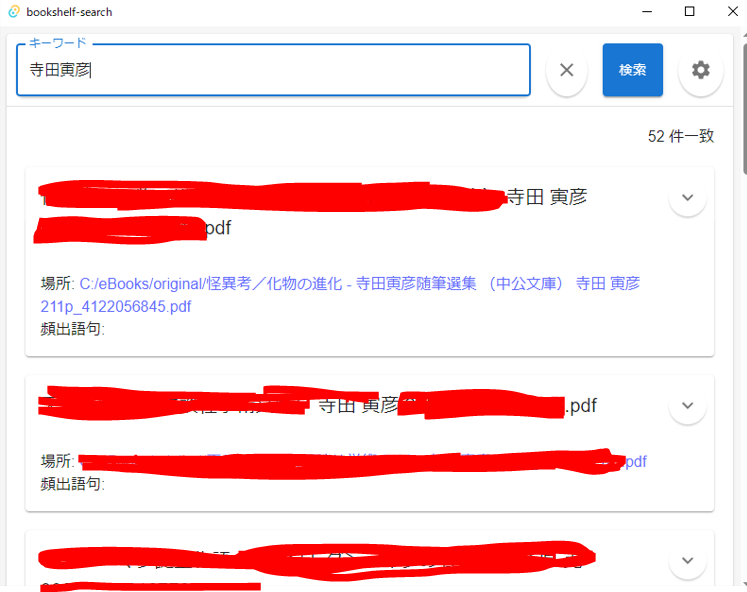

# bookshelf_search

## はじめに

bookshelf_searchはOCRテキスト入りPDFの内容を抽出し、検索用にインデクシングし、GUI上から検索するための仕組みです。

個人的に運用しているものなので、機能追加要求等に答える事は難しいです。また、日本語Windows環境での開発・運用のみを考えています。
MITライセンスの範囲内でフォークして自由に利用してください。

また、元となるpdfファイルおよびインデックス化されたテキストデータについては著作権法で定められる私的複製の範囲内で利用してください。

## bookshelf_searchについて

以下の2つのソフトウェアから成り立っています

- OCRテキスト入りPDFの内容をインデックスとして登録するためのコマンドラインツール
- 検索用GUI (Tauri製)

定期的にコマンドラインツールでインデックスの登録を行い、デスクトップアプリから検索を行うという利用イメージです。

前者の詳細については[indexer_cli/README.md](indexer_cli/README.md)を参照してください。

### 利用に必要なソフトウェア

#### Elasticsearch

インデックス情報を保存するためにElasticsearchをインストールする必要があります。
手元環境では後述のSudachiプラグインを使用するために最新バージョンではなくv8.6.0を使用しています。

一般的なインストール方法については下記を参照してください。

https://www.elastic.co/guide/en/elasticsearch/reference/current/install-elasticsearch.html


ElasticsearchはJavaを必要とします。Javaのインストールや必要なJavaバージョンなどインストールの詳細についてはWebで関連サイトを見てください。

また、運用の面倒さをなくすためにElasticsearchをWindowsサービスとして登録することを推奨します。

注意点として、絶対に不特定多数からElasticsearchの内容を自由に参照できる状態にはしないでください。あくまで私的複製の範囲内で使用してください。

#### Elasticsearch Sudachiプラグイン

日本語形態素解析のためのElasticsearchプラグインです。
Elasticsearchへのインストール方法については下記を参照してください。

https://github.com/WorksApplications/elasticsearch-sudachi
https://github.com/WorksApplications/elasticsearch-sudachi/blob/develop/docs/tutorial.md

インストールの詳細についてはWebで関連サイトを見てください。


### 検索用GUIのビルドに必要なソフトウェア

Node.jsとnpmを利用可能にしてください。

https://nodejs.jp/
https://community.chocolatey.org/packages/nodejs


## 検索用GUIのビルド

初回ビルド時にnpm ciを実行してください。

```
$ npm ci
```

二回目以降は下記コマンドでビルドしてください

```
$ npm run tauri build
```

`src-tauri\target\release\bundle\msi\`フォルダ配下にmsiファイルが作成されるので、ダブルクリックしてインストールしてください。

## 検索用GUIの利用方法

GUIを起動する前に、pdfファイルからOCRテキストを抽出してElasticsearchのインデックスに登録する必要があります。詳細については`.\indexer_cli\README.md`を参照してください。

ここでは、インデックスが登録済みであることを前提とします。

初回起動時、設定ボタンから設定画面を開いてください


以下の設定を行ってください

- elasticsearchのURL
- ユーザーID
- パスワード
- インデックス名（デフォルトは`bookshelf_search`。基本的には変える必要なし）


設定終了後、適当なキーワードで検索すると結果が戻るはずです。スペースで区切ることでAND検索となります。また、キーワードを`OR`で区切ることでOR検索となります。



`V`アイコンをクリックすると、キーワード前後の文章を表示することができます。
また、`場所`のリンクをクリックするとpdfファイルのパスがコピーされます。